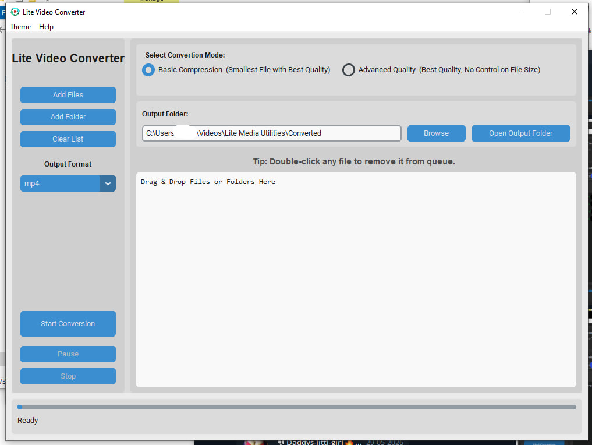
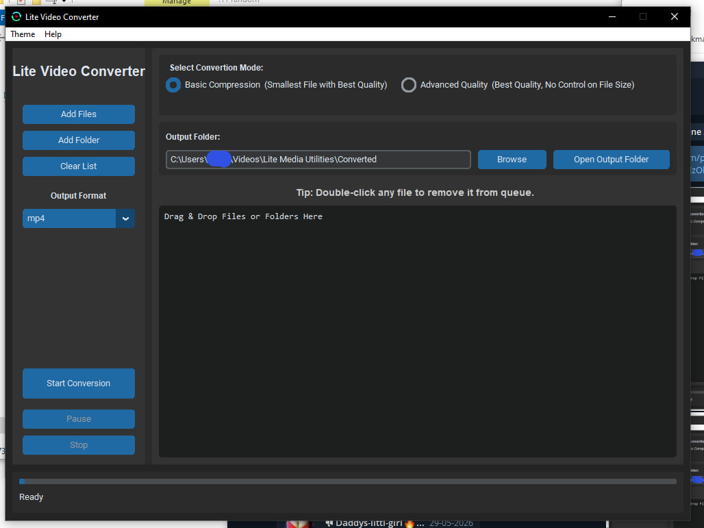
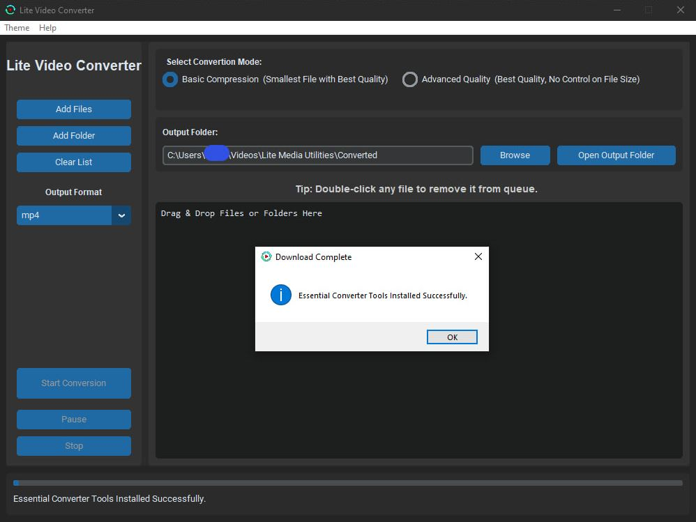
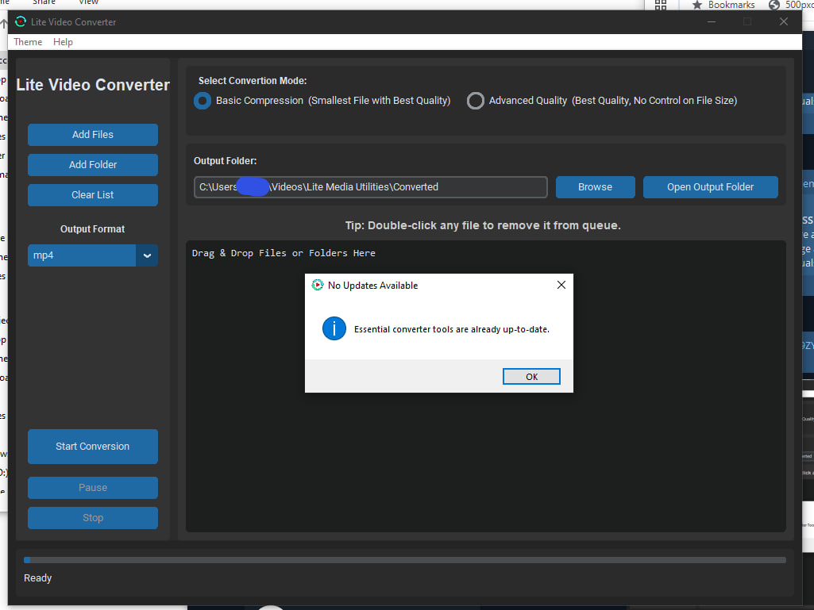
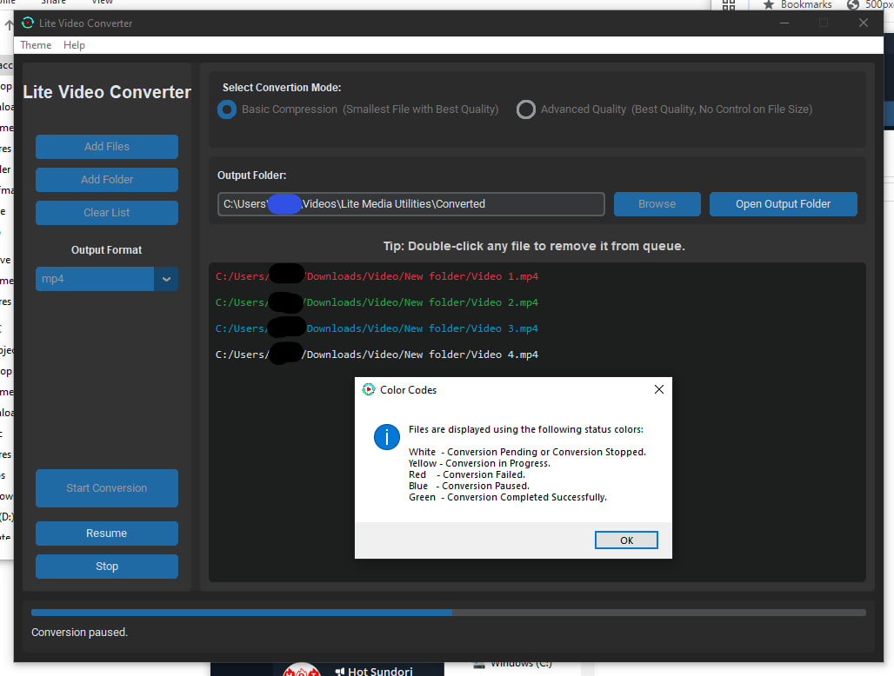
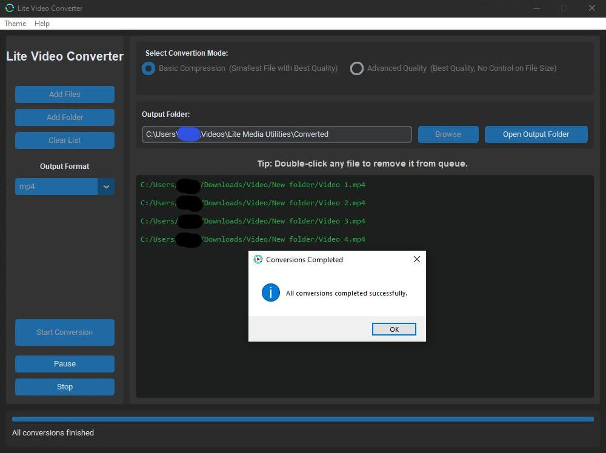

# Lite Video Converter
A lightweight desktop video conversion utility built with Python and FFmpeg.

Lite Video Converter is designed to provide a simple, fast, and beginner-friendly video conversion experience without requiring users to manually install or configure FFmpeg. It is a beta release and a supporting app for a Downloader.

## Screenshots

### Main Window (Light Mode)

  

  
 More Screenshots 

### Main Window (Dark Mode)

  

> The app supports 18 more Skins both in Light & Dark Modes.

### Successful Installation

  

### Updated App

  

### Color Codes

  

### Successful Conversion

  

## Features
* Simple graphical interface
* It has *Basic* & *Advance* Modes.
  * *Basic Modes* provides a quick conversion. It generates mostly a compressed file in the best quality.
  * *Advanced Mode* converts the file to the selected format in the best quality. The file size increases 
* FFmpeg-powered video conversion
* Automatic FFmpeg management
* Automatic update checker during startup
* Light and Dark mode support with 19 skins
* Custom output folder selection
* Shared component framework for future Lite Media Utilities applications

## Formats Supported
You can convert files from formats - ".avi", ".flv", ".gif", ".m4v", ".mkv", ".mov", ".mp4",  ".ts", ".wmv", ".webm" to ".avi", ".gif", ".mkv", ".mp4", ".webm"

## Requirements
### Operating System
* Windows 10
* Windows 11

### Graphics Card
Recommended for faster and *Advanced Quality* conversions but not mandatory.

### Dependencies

No manual dependency installation is required.

Lite Video Converter automatically manages the components it needs.

## Installation
1. Download the latest installer from the Releases page.
2. Run the installer.
3. Launch Lite Video Converter.
4. Start converting videos.

## Updating

The application can:

* Automatically check for updates during startup
* Perform manual update checks from the menu (*Help > Check for Updates or Repair*)

Updates are distributed through GitHub Releases. The updates' download time depends on GitHub traffic.

## Uninstallation

The application can be uninstalled from the Windows Control Panel.

Converted media files (and folders) are intentionally preserved during uninstall to prevent accidental data loss.

## Project Structure

Lite Video Converter is the first application under the Lite Media Utilities ecosystem.

Future applications will share:

FFmpeg
7-Zip
Themes
Configuration systems
Update infrastructure
Common utility libraries

to reduce duplicate installations and improve maintainability.

## Roadmap

Planned future projects:

* Additional FFmpeg utilities
* Expanded theme support
* Shared utility framework improvements
* Enhanced installer and maintenance tools
and more...

## License

This project is distributed under the selected repository license.

## Download

Latest Release:

https://github.com/Lite-Media-Utilities/Lite-Video-Converter/releases

## Version

Current Stable Version: v1.0.0 (05.06.2026)

## Security / Transparency
* VirusTotal scan available for the latest release (SHA-256 : a19e69d1e9d8fb4c353a346da562106f2344565d51055179923fb8f0125e2881) (1/69)
* No external trackers
* No data collection
* External code downloading involves only from FFMPEG's [GitHub](https://github.com/Lite-Media-Utilities/Lite-Video-Converter/releases/") or [Official Page](https://www.gyan.dev/ffmpeg/builds/ffmpeg-git-essentials.7z").

## Disclaimer
This script is intended for personal archival and educational purposes only.

Users are responsible for complying with FFMPEG's Terms of Service and applicable copyright laws.

Do not use this project for tasks involving piracy of copyrighted content or circulation of illegal content.

The author is not responsible for the misuse of this software.
